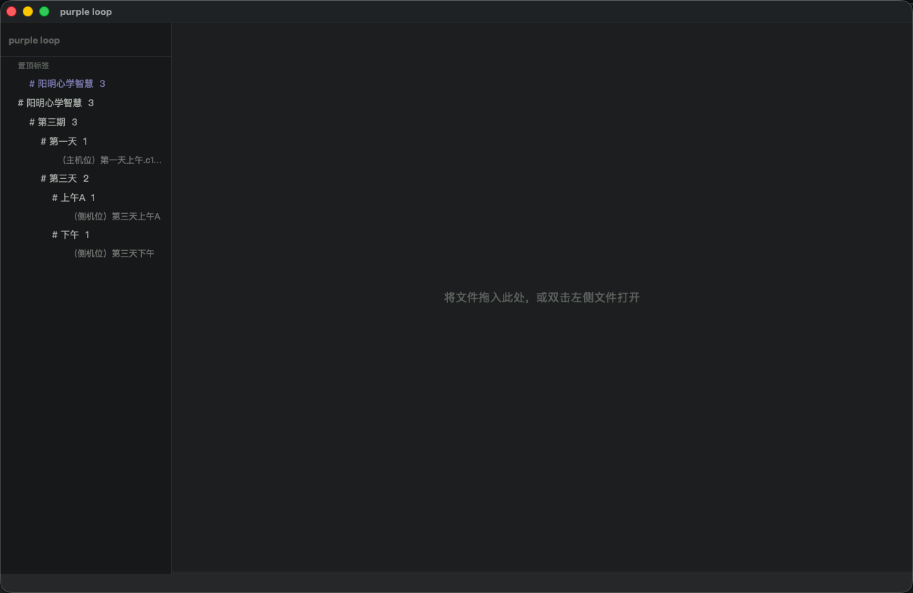
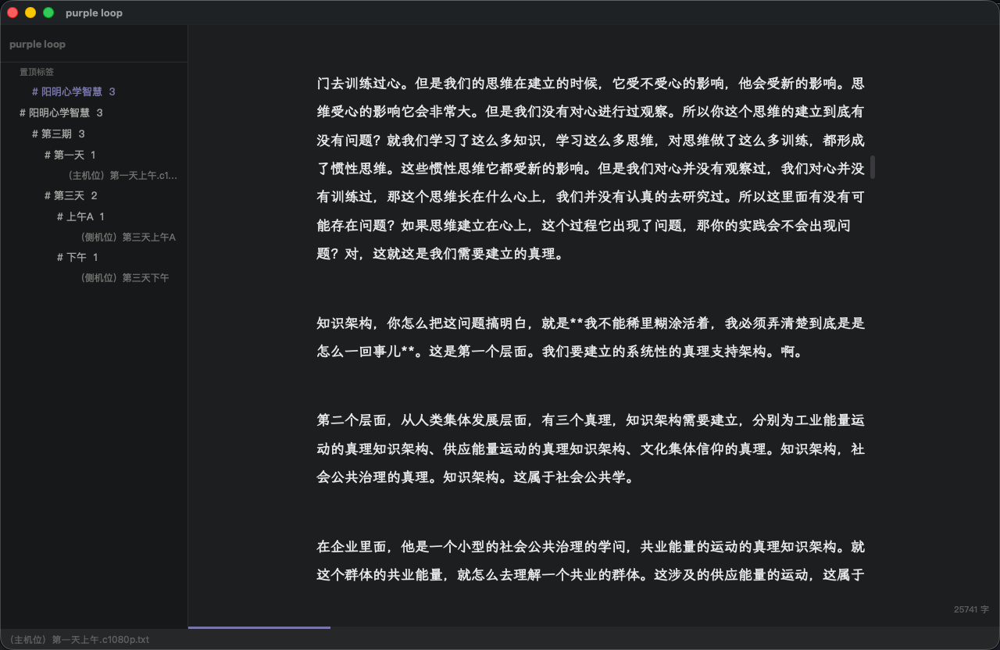
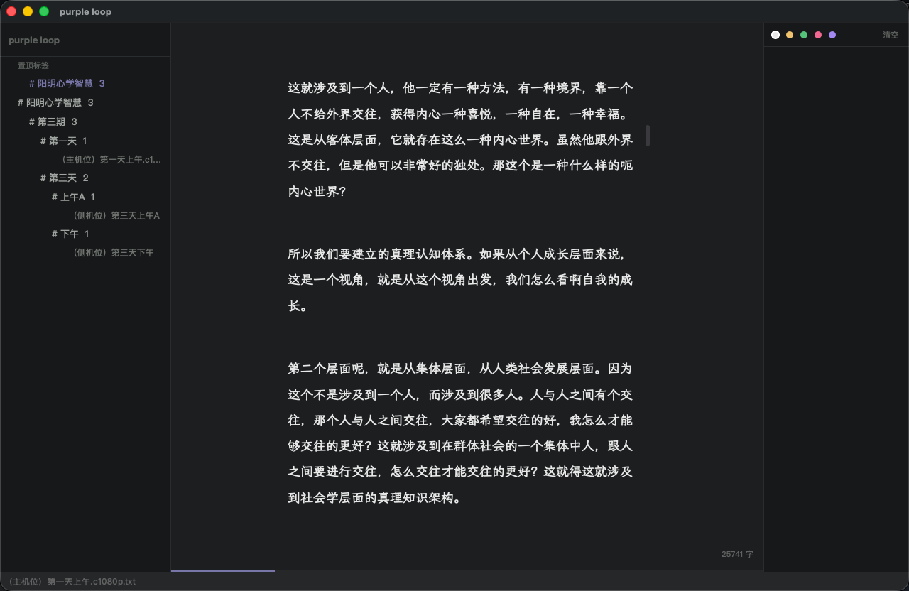
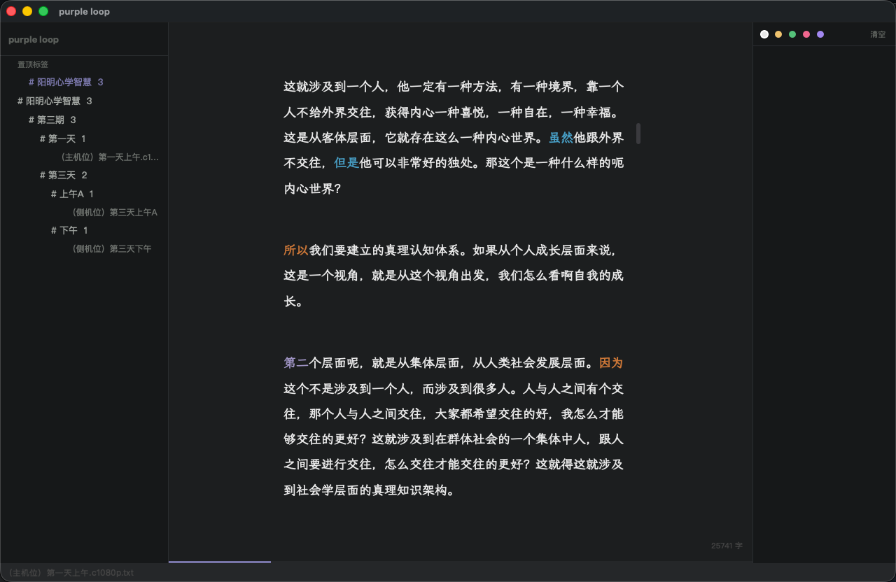
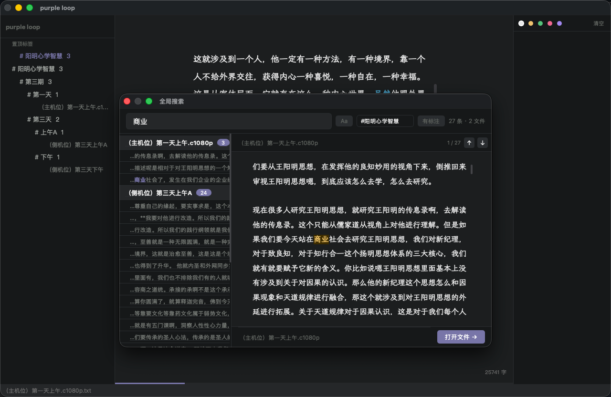
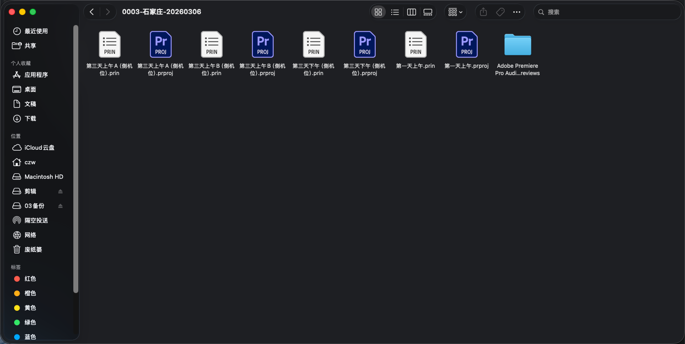
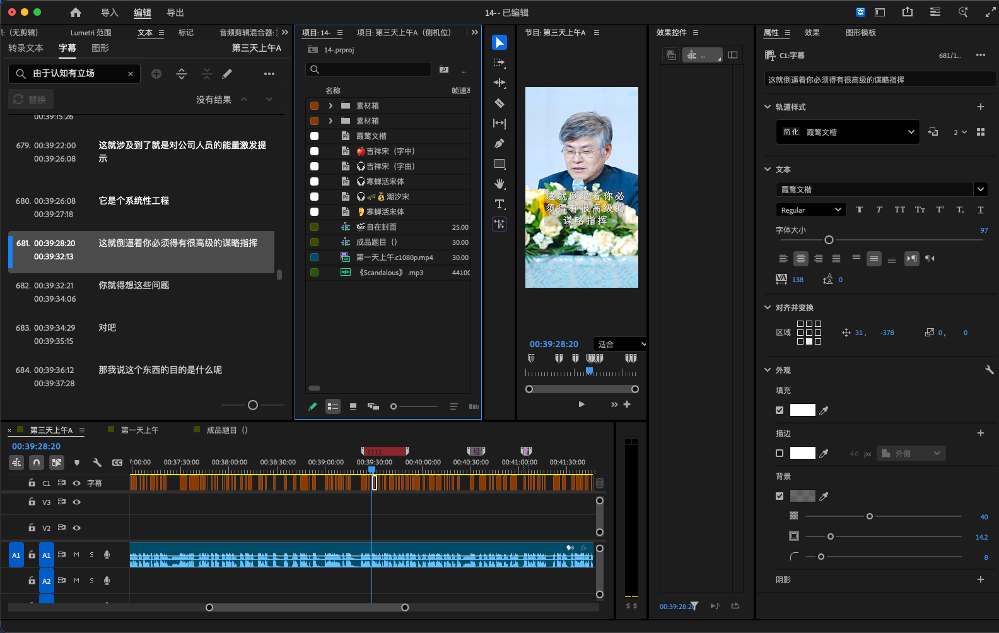

# purple loop

> 专为逐字稿精读设计的桌面阅读器  
> A desktop reader built for deep-reading transcripts.

为播客人、视频创作者打造。把逐字稿读透，才能剪出真正好的内容。



---

## 安装 · Install

从 [Releases](https://github.com/thatgameapple/purple-loop/releases) 下载最新版：

- **macOS**：下载 `.dmg`，拖入应用程序文件夹
- **Windows**：下载 `.zip`，解压后运行 `purple loop.exe`

首次打开 macOS 版本时，**右键点击 app → 选「打开」**，在弹出的提示中再次点「打开」即可。之后双击正常启动。

> 这是 macOS 对未签名第三方应用的标准安全提示，操作一次即可。

---

## 导入文件

支持直接拖入 `.txt` 和 `.srt` 文件。

### SRT → 阅读排版

将 PR 或语音识别导出的 `.srt` 字幕文件拖入窗口，自动转换为适合阅读的排版：

- 去除所有标点，替换为空格
- 按时间停顿（>1.5 秒）自动分段
- **转出的文字与 SRT 原文字字一致**，可直接复制到 PR 文字搜索，精准定位时间码

### TXT 阅读排版

直接拖入 `.txt` 文件（逐字稿、小说、文章均可）：

- 自动去除所有标点，替换为空格
- 超长段落自动切块，避免出现文字墙
- 原始文件不会被修改

---

## 核心功能

### 阅读锁定

侧栏右上角的 **▶ / ⏸ 按钮** 控制编辑模式：

- 默认 **▶ 只读状态**，防止误操作修改文字内容
- 点击 **▶** 解锁，进入可编辑状态（显示 ⏸）
- 点击 **⏸** 重新锁定
- 切换文件时自动恢复只读

> 核心约束：逐字稿每个字对应 PR 时间码，误删改字会导致 PR 搜索对不上。锁定设计正是为此。

字号、行距、行宽均已调至最适合中文阅读的参数，打开即读，无需任何设置。底部进度条实时显示阅读位置，关闭后重新打开自动回到上次位置。



---

### 标注系统

选中 5 个字以上，松开鼠标，浮动工具条自动弹出。



| 标注类型 | 用途建议 |
|----------|----------|
| 🟡 黄色高亮 | 核心观点 / 精华金句，优先保留 |
| 🟢 绿色高亮 | 精彩表达，可直接用作成片素材 |
| 🩷 粉色高亮 | 需关注 / 存疑，待核实或需补拍 |
| 🟣 紫色高亮 | 延伸话题 / 备用，留给下一期 |
| **B** 加粗 | 长段落中标出最重要的词 |
| U 下划线 | 专有名词 / 需查证 |
| **# 自由备注** | 输入任意文字备注，如「语速太快」「第二集用」|

`Ctrl+\` 打开标注面板，所有标注按顺序排列，点击卡片跳回原文位置。支持按颜色或备注筛选。

---

### 话语标记词高亮

用四种颜色显示逻辑连接词，直观呈现说话人的逻辑结构。



| 颜色 | 类别 | 例词 |
|------|------|------|
| 橙色 | 因果 | 因为、所以、由于、因此 |
| 蓝色 | 转折 | 但是、不过、然而、虽然 |
| 绿色 | 递进 / 举例 | 而且、比如说、换句话说 |
| 淡紫 | 结构 / 衔接 | 首先、接下来、总之、那么 |

配合「语气词高亮」，还可以高亮嗯、哎、就是、那个等口语填充词，以及通过「口头禅频率分析」统计各词出现次数。

**视图菜单**开启以上功能。

---

### 全局搜索

`Ctrl+K` 打开全局搜索，跨所有文件搜索关键词。左侧显示命中文件列表，右侧预览完整内容并高亮所有命中位置，`↑` `↓` 跨文件连续跳转。支持按标签筛选范围。



---

### 配合 PR 精准剪辑

SRT 转出的逐字稿文字与 PR 时间码字字对应。在 purple loop 里读透内容、标记好关键段落后，直接复制片段到 PR 文字搜索，精准定位时间码剪辑，无需反复拖拉进度条。





---

## 推荐工作流

1. 将 PR 导出的 **SRT** 拖入 purple loop，自动转为阅读排版
2. 开启**话语标记词高亮**，看清逻辑骨架
3. 用颜色**标注**段落，打开标注面板（`Ctrl+\`）纵览全局
4. 用 `#` 备注记录剪辑思路（「可剪掉」「需补拍」「第二集用」）
5. 带着清晰的判断去 PR，**复制片段文字** → 文字搜索 → 精准定位时间码

---

## 标签系统

在文字中直接写 `#标签` 或 `#父级/子级`，侧栏自动归类。

```
今天录了第三期 #阳明心学智慧/第三期/第一天
```

支持标签置顶（右键菜单）、标签重命名、标签合并。

---

## 快捷键

| 快捷键 | 功能 |
|--------|------|
| `Ctrl+K` | 全局搜索 |
| `Ctrl+F` | 当前文件内搜索 |
| `Ctrl+S` | 保存 |
| `Ctrl+\` | 显示 / 隐藏标注面板 |
| `Ctrl+Shift+Z` | 禅定模式（隐藏所有界面）|
| `Cmd+↑` | 跳到文章开头 |
| `Cmd+↓` | 跳到文章末尾 |
| `F5` | 刷新侧栏 |

---

## 设计理念

- 纯黑背景 `#1c1e1f`，专注阅读
- 低饱和度紫色点缀 `#7c6fa8`
- 纯文本 `.txt` 存储，数据永远属于你
- 不做笔记，不做导出，只帮你把稿读透

---

## 技术栈

Python · PyQt6
